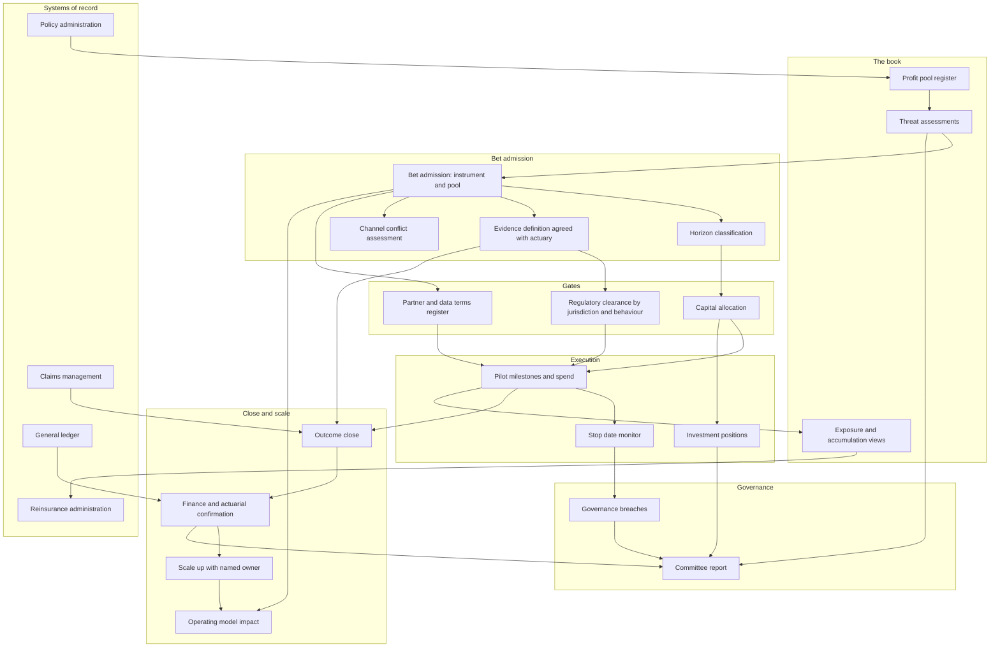

# Pilothouse

**Source:** `ai-in-insurance/insurance_innovation_report_2016/`
**Domain:** `ai-ins`
**One-liner:** An innovation portfolio system for incumbent insurers that ties every insurtech pilot, partnership, and minority investment to the specific profit pool it defends or attacks, and closes each bet on underwriting-grade evidence — loss ratio, expense ratio, and persistency — rather than on a demo and a press release.
**Wedge:** The corporate innovation function of a multi-line incumbent with a venture fund or accelerator relationship, entering through the motor and property book where telematics, connected-home, and drone-assisted claims pilots already compete for the same budget and none of them can prove a ratio movement.
**Positioning:** Portfolio management for external innovation, in the insurer's own financial language. Accelerators source startups and venture arms source deals; Pilothouse is the register that connects a bet to a threatened profit pool, holds the regulatory clearance a pilot needs before it touches pricing or claims, and reports realised ratio movement per bet — so an insurer can tell which of its forty partnerships is actually defending the book.

## Market research synthesis

### Thesis from source

The report's framing is that insurance was, until recently, a virtual island in a sea of technological change, and that the era of relative stability has ended. It sizes the overall market at USD 4.5 trillion and notes that new digital players remain a tiny share of it, but argues they compete asymmetrically by targeting specific segments of the value chain, benefiting from fewer legacy costs, greater specialisation, higher risk tolerance and agility — with 44 percent of insurance technology companies having fewer than ten employees. The capital behind them accelerated sharply: insurtech investment more than tripled from USD 740 million in 2014 to above USD 2.6 billion in 2015, and the first quarter of 2016 was the second largest financing quarter ever in the space with more than 45 deals raising USD 650 million. The report also identifies the structural weakness the attackers exploit: a 2014 Morgan Stanley and Boston Consulting Group survey found consumers interacted less with insurers than with any other industry studied, and much of the business is intermediated, with brokers amassing an impressive USD 45 billion in annual compensation from insurers around the world. Low contact frequency plus a large intermediation pool is precisely the profile that invites disintermediation.

The body then catalogues where the attacks land, and the numbers are specific enough to be treated as target definitions. Telematics: the insurance telematics market growing from USD 857 million in 2015 to a projected USD 2.2 billion in 2020, with Octo reporting more than 60 insurance partners, four million active end users, over 100 billion miles of driving data accumulating at 60,000 miles a minute, and drivers benefiting from savings of up to 30 percent; Metromile claiming average savings of USD 500 a year for low-mileage customers. Connected home: American Family offering a USD 30 device discount plus a possible 5 percent policy saving, State Farm discounting for a monitored security system, PURE discounting for temperature monitoring. Wearables and life: Vitality partnering with Prudential in the UK, Ping An, AIA Singapore, and John Hancock, with policyholders able to save as much as 15 percent of annual premium; Oscar Health, valued at USD 2.7 billion, paying a USD 20 monthly reward for meeting step goals twenty times a month. On-demand and peer-to-peer: Trōv with USD 39 million raised, over 940,000 items worth USD 8.5 billion catalogued, and partnerships with Suncorp and AXA; Guevara claiming groups can save upwards of 50 percent; Friendsurance reporting average cashback of a third of paid premiums and 20 percent monthly growth in 2014. Drones: Munich Re working with PrecisionHawk to capture all affected areas within days of the April earthquake in Ecuador, with its head of claims stating that drone techniques may become standard in loss adjustment and claims management; more than ten US insurers including AIG, Liberty Mutual, and State Farm obtaining regulatory approval in 2015 to research commercial drone use.

The report separates these from what it calls the next wave — blockchain and artificial intelligence — whose impact it expects to take longer to materialise. Its blockchain numbers are about leakage and cost: an estimated 65 percent of all fraudulent claims go unnoticed, with fraud costing insurers approximately USD 60 billion annually in the US and Europe alone; Goldman Sachs estimating USD 2 to 4 billion of savings in the US title insurance market; Everledger recording over 850,000 diamonds; Allianz and Nephila piloting a smart contract for a natural catastrophe swap; AIA and Ping An joining a consortium; a French initiative launched with 17 partners including four insurers. Its AI numbers point at cost and capacity: a Deloitte forecast of the US cognitive computing market growing from USD 1 billion to USD 50 billion by 2018, Accenture research that 82 percent of insurers agree ai-driven automation will be embedded into every aspect of business within five years, and IPsoft's cognitive agent resolving issues 50 percent faster than a human. Indirect effects are sized too: autonomous vehicles as a USD 42 billion market in 2025 and potentially 25 percent of new car sales globally by 2035, against a global motor market worth over USD 670 billion in gross written premiums in 2014 and 94 percent of US crashes attributable to driver error — the clearest statement in the document that a profit pool can be structurally removed rather than merely competed for.

The report's closing sections describe the incumbent response and, inadvertently, the reason the response underperforms. Generali allocated EUR 1.25 billion for reinvesting in technology, data analytics, and more flexible operating platforms. AIG, Aviva, AXA, MetLife, and Ping An created specialised venture funds, and insurers had earmarked more than USD 1 billion for investing in startups. Aviva opened digital garages in London and Singapore; Allianz and Swiss Re joined an insurtech accelerator; 43 percent of insurers in a 2014 Accenture survey were planning or had completed acquisitions of startups or innovative competitors. Allianz's chief digital officer is quoted saying there is a huge gap between what startups can do in service renewal and reacting to changing customer needs and what incumbents typically manage, and that the industry needs to allocate resources faster and more boldly to emerging profit pools. Meanwhile McKinsey is cited forecasting that up to a quarter of full-time positions in Western European insurance will be consolidated or replaced as a net aggregate by 2025, and regulators are described as moving with the market — the association of supervisors publishing on cyber risk, US commissioners investigating price optimisation, and taking the position that peer-to-peer entrants should be regulated like any other insurance company within the existing framework. So the industry has capital, vehicles, accelerators, and acquisition appetite, plus a workforce consequence and a moving regulatory perimeter, and no described mechanism for connecting a specific bet to a specific threatened pool and a realised financial outcome. That mechanism is the product.

### Buyer & economic model

- **Primary buyer:** Chief Innovation Officer or Chief Digital Officer, co-sponsored by the corporate development lead who runs the venture fund and by the Chief Underwriting Officer whose book the bets are meant to defend.
- **Users:** innovation and partnership managers (weekly), corporate venture investment managers (per deal), business-unit sponsors in motor, property, life, and health (per pilot), underwriting and pricing actuaries (at pilot design and at close), claims transformation leads (for loss-adjustment pilots), reinsurance and catastrophe managers (for exposure and capital-structure bets), procurement and third-party risk (per partnership), compliance and regulatory affairs per jurisdiction (per pilot), finance for capital allocation and benefit confirmation (quarterly), workforce planning (on operating-model consequences), and the executive committee or board innovation committee (quarterly).
- **Budget owner / value metric:** the innovation and corporate venturing envelope, sized in the source's own terms — the EUR 1.25 billion technology reinvestment and the more than USD 1 billion earmarked for startup investment are the scale of budget being governed. The value metric is ratio movement per bet: loss-ratio points defended or gained, expense-ratio points removed, persistency and new-business retention effect, and for investments a return measure held separately from the strategic effect so that a financial gain never disguises a strategic failure.
- **Competing status quo:** an innovation pipeline in a spreadsheet, a venture portfolio tracked by the corporate development team on financial metrics only, pilots run inside business units with locally defined success criteria, an accelerator relationship producing demo days, and partnership contracts held by procurement. The failure mode the source implies is precise: nothing links the bet to the pool it defends, pilot success is declared by the sponsor, and the regulatory question is asked after the pilot has already touched a customer's price.

### Domain constraints

- **Regulatory / trust / safety:** the source describes regulators moving with the market, and each of its technology categories carries a live constraint. Behavioural pricing from telematics and wearables raises unfair-discrimination and price-optimisation questions of exactly the kind the US commissioners were investigating, so a pilot that varies price needs clearance before exposure. Peer-to-peer structures must be treated as insurance carriers within the existing framework, which means a pooling pilot is a licensing and capital question, not a product experiment. Drone-based loss adjustment requires aviation authorisation, as the source's account of US insurers obtaining approval in 2015 shows. Cross-border data restrictions complicate centralising the data a partner needs, and cyber-resilience expectations rise as the insurer becomes dependent on partner systems. Incentives and rewards must not become inducements, and any partner touching claims or underwriting decisions falls inside the insurer's outsourcing and accountability perimeter.
- **Data sensitivity:** partnership pilots routinely require handing policyholder data to a startup with ten employees, which is simultaneously a data-protection question, a third-party risk question, and a commercial one — the partner gains the insurer's most valuable asset. Behavioural feeds from cars, homes, and wearables are continuous personal data with revocable consent, and health inference is special-category. Investment diligence data on a target is market-sensitive. The insurer's own loss experience shared with a partner for model building can leak pricing structure to a future competitor, so data-sharing terms and exit provisions belong in the portfolio record rather than only in the contract file.
- **Change-management realities:** the source's own diagnosis — a huge gap between startup and incumbent speed, and a call to allocate resources faster and more boldly — means the governance has to be lighter than the insurer's standard project process without becoming ungoverned, which is why stage gates should be few and evidence-based rather than numerous and document-based. Business units will resist pilots that disturb broker relationships, given the USD 45 billion intermediation pool the source quantifies. Pilots that succeed technically often fail on integration into a legacy policy or claims platform. Workforce consequences are real and slow — a quarter of positions consolidated or replaced by 2025 on the cited forecast — so the operating-model implication of a bet must be recorded when the bet is made, not discovered at scale-up.

## Business requirements

- BR-1: Every innovation bet must be linked at admission to the specific profit pool it defends or attacks, and a bet that cannot name a pool must be rejected or reclassified as pure research with a capped budget.
- BR-2: The portfolio must maintain a threat register of the insurer's profit pools with their exposure to structural erosion, so that capital allocation can be argued against where the book is actually at risk rather than where the technology is most interesting.
- BR-3: Each pilot must define its success evidence in the insurer's financial language — loss-ratio, expense-ratio, persistency, or new-business volume effect — with the measurement population and window agreed before launch, and a pilot may not be declared successful on engagement or usage metrics alone.
- BR-4: No pilot may vary a policyholder's price, alter an underwriting decision, or determine a claims outcome before recorded regulatory clearance for that behaviour in that jurisdiction.
- BR-5: Bets must be classified by horizon so that near-term capability bets and longer-dated bets are funded from separate allocations and are never compared on the same payback expectation.
- BR-6: Every partnership must record its data-sharing terms, the policyholder data categories exposed, the partner's dependency classification, and the exit and data-return provisions, before any policyholder data leaves the insurer.
- BR-7: Minority investments must be reported on financial return and strategic effect separately, so that a profitable stake in a company that never helped the book is not counted as innovation success.
- BR-8: Each bet must record the operating-model and workforce consequence of scaling it, so that the headcount and capability implications are visible when the decision is made rather than at rollout.
- BR-9: Bets that would disturb intermediated distribution must record the channel-conflict assessment and the commission or compensation implication, given the scale of broker compensation the market pays.
- BR-10: Every pilot must carry a stop decision date and a defined stop criterion, and the portfolio must report pilots past their decision date as a governance breach.
- BR-11: Pilots touching catastrophe response or exposure accumulation must record their effect on the insurer's exposure management and reinsurance arrangements, so that a faster claims capability does not create an unmanaged accumulation view.
- BR-12: The portfolio must report quarterly on committed capital, bets by profit pool and horizon, realised ratio movement, stops, and clearance blockages, and that report must govern the release of further capital.
- BR-13: Scale-up beyond pilot must require a named business-unit owner accepting the run cost into their expense base, so that innovation output does not accumulate as unowned central cost.

## User stories

Canonical user stories live in sibling [USER_STORIES.md](USER_STORIES.md).

## System design

### Overview

Pilothouse starts from the book rather than from the technology. A threat register describes the insurer's profit pools — motor premium, property premium, life protection, the intermediated distribution margin — each with an exposure assessment for structural erosion. Bets are admitted against that register: a bet declares the pool it defends or attacks, its horizon, its instrument (internal pilot, commercial partnership, minority investment, accelerator engagement, or acquisition), and the evidence it will produce in ratio terms with an agreed measurement population and window. Two gates then apply. A clearance gate holds per-jurisdiction permissions for the behaviours a bet needs — varying price, making an underwriting decision, determining a claims outcome, operating an aircraft, or pooling risk — and refuses launch of an uncleared behaviour. A partner gate records data-sharing terms, exposed data categories, dependency classification, and exit and data-return provisions before policyholder data leaves the insurer. Live bets accumulate evidence, and the close cycle compares realised ratio movement to the agreed evidence definition, with finance confirming the financial component. Scale-up is a separate decision requiring a named business-unit owner to accept the run cost, and it carries the operating-model and workforce consequence recorded at admission. Around this sits capital allocation by pool and horizon, a stop-date monitor, and the quarterly committee view that governs further release.

### Actors & boundaries

- **Actors:** Chief Innovation Officer, corporate venture investment manager, innovation and partnership manager, business-unit sponsor, underwriting and pricing actuary, claims transformation lead, catastrophe and reinsurance manager, regulatory affairs officer per jurisdiction, third-party risk and procurement manager, finance business partner, workforce planner, executive or board committee, and the external counterparty — startup, vendor, accelerator, or reinsurer.
- **Trust boundary:** policy administration, claims, the general ledger, and the exposure management system remain systems of record; Pilothouse holds the threat register, the bets, the clearances, the partner terms, the evidence definitions, and the close. Ratio movement is confirmed by finance and by the actuarial function, never asserted by the innovation team. Counterparties see only their own bet, their obligations, and the milestones — never the threat register or other bets. Policyholder data never flows through Pilothouse; the platform records the authorisation, the categories, and the terms under which data moves directly between the insurer's systems and the partner.
- **Human-in-the-loop points:** admission of a bet against a named pool; clearance grant or withholding per jurisdiction and behaviour; partner terms approval before data movement; agreement of the evidence definition by the actuary and the sponsor; stop decision at the recorded date; finance confirmation of ratio movement; scale-up acceptance by a named business-unit owner; catastrophe and reinsurance sign-off where exposure views change.

### Core capabilities

1. **Profit pool threat register** — the insurer's pools, their premium and margin scale, and their exposure to structural erosion and to asymmetric attack.
2. **Bet admission** — instrument, targeted pool, horizon, thesis, and required behaviours, with rejection of unlinked bets.
3. **Evidence definition** — the ratio measure, measurement population, comparison basis, and window, agreed by sponsor and actuary before launch.
4. **Regulatory clearance gate** — per-jurisdiction permissions for pricing variation, underwriting decisions, claims determination, aviation operation, and risk pooling.
5. **Partner and data-terms register** — dependency classification, exposed data categories, sharing terms, exclusivity, and exit and data-return provisions.
6. **Investment position tracking** — stake, valuation, and financial return reported separately from strategic effect, cross-linked to any commercial bet with the same counterparty.
7. **Pilot execution and milestone tracking** — milestones, spend, stop date, and stop criterion with breach reporting.
8. **Outcome close** — realised ratio movement confirmed by finance and actuarial, against the agreed definition.
9. **Scale-up and ownership transfer** — run-cost acceptance by a named business-unit owner, with operating-model and workforce consequence attached.
10. **Channel-conflict assessment** — effect on intermediated distribution and commission or compensation implications.
11. **Exposure and reinsurance impact** — effect of a bet on accumulation views, catastrophe response, and treaty arrangements.
12. **Capital allocation and committee reporting** — committed and deployed capital by pool, horizon, and instrument, with the quarterly governance pack.

### Conceptual data

- **Primary entities:** ProfitPool, ThreatAssessment, InnovationBet, Instrument, HorizonClass, Counterparty, PartnershipTerms, DataSharingTerms, InvestmentPosition, RegulatoryClearance, ClearanceBehaviour, EvidenceDefinition, PilotMilestone, SpendCommitment, OutcomeClose, RatioMovement, ScaleUpDecision, OperatingModelImpact, ChannelConflictAssessment, ExposureImpact, StopDecision, CommitteeReport.
- **Critical events:** pool threat assessed, bet admitted or rejected, evidence definition agreed, clearance requested, granted, or withheld, partner terms approved, data movement authorised, pilot launched, milestone met or missed, spend committed, stop date reached, stop decided, outcome closed with finance confirmation, scale-up accepted or declined, ownership transferred, investment marked, exposure view revised, committee report issued.
- **Retention / audit needs:** clearances and the behaviours they permit must be retained for the life of the resulting capability plus the conduct and complaint window, because a pricing behaviour trialled in a pilot may be challenged years later. Data-sharing terms, authorisations, and data-return evidence retain for the data-protection accountability period and for the duration of any dispute with a former partner. Investment positions and valuations retain to statutory accounting and tax requirements. Outcome closes and their finance confirmations retain long enough to support a retrospective on the innovation programme's returns, which is the only defence of the envelope at the next planning cycle. Stop decisions are permanent records, since the credibility of the stop date depends on the precedent.

### Integrations (conceptual)

- **Systems of record:** policy administration and premium systems for pool sizing, claims management for indemnity and cycle-time evidence, general ledger and management accounts for spend and confirmed benefit, exposure management and reinsurance administration, contract lifecycle management for partnership agreements, cap-table and investment accounting for stakes, procurement and third-party risk systems.
- **Upstream signals:** insurtech funding and deal intelligence, accelerator and venture pipelines, competitor and market monitoring, regulatory and supervisory publications by jurisdiction, aviation and sector authorisation registers, catastrophe event feeds, actuarial experience studies used as the comparison basis for pilot evidence, workforce plans and capability inventories.
- **Downstream actions:** capital release to bets, launch authorisation or refusal to pilot teams, data movement authorisation to the systems that hold policyholder data, stop notices and closure, scale-up transfer into a business unit's budget, exposure view revisions into reinsurance planning, channel-conflict briefings to distribution management, and the quarterly board and executive committee pack.

### High-level architecture

The register is deliberately organised around the book, not the pipeline. A bet cannot be admitted without a pool, cannot launch a regulated behaviour without a clearance, cannot move data without terms, and cannot be declared successful without finance confirming the ratio movement against a definition agreed before launch.

### Success metrics

- **Leading:** share of bets linked to a named profit pool; share of pilots with an evidence definition agreed by an actuary before launch; clearance obtained before first regulated behaviour, targeting full coverage; partnerships with complete data-sharing and exit terms before data movement; pilots within their stop date; capital deployed against allocation by pool and horizon; median time from bet admission to launch, which is the direct test of the speed gap the source describes between startups and incumbents.
- **Lagging:** loss-ratio and expense-ratio points confirmed by finance per bet and per pool; persistency and retention effect on pilot populations; share of pilots reaching scale-up with a named business-unit owner accepting run cost; stop rate and capital recovered from stopped bets; investment return reported separately from strategic effect; movement in the threat assessment of the pools the portfolio was funded to defend — including the intermediated distribution margin against the scale of broker compensation the market pays, and motor premium against the erosion the source's autonomy figures imply; regulatory findings arising from pilots, targeting zero.

## OpenAPI skeleton

Canonical HTTP surface lives in sibling [openapi.yaml](openapi.yaml). Summary:

- **Base path:** `/v1/...`
- **Auth:** `X-API-Key` for ledger, policy, claims, and deal-intelligence integrations; Bearer JWT for innovation, investment, actuarial, regulatory, and committee users, with clearance and scale-up acceptance restricted by role.
- **Resource groups:** Pools, Bets, Clearance, Partnerships, Investments, Outcomes, Governance.
