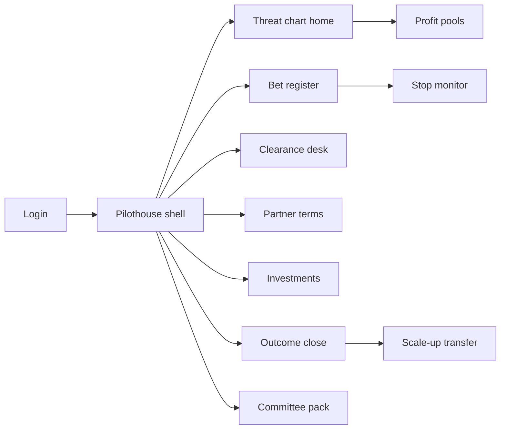
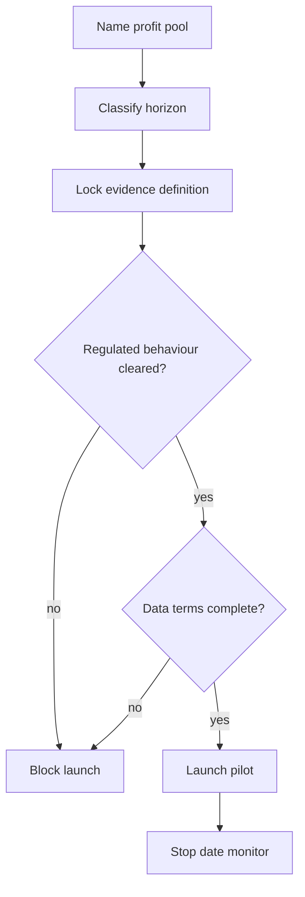

# Pilothouse — Web app

**Product:** [PRODUCT.md](./PRODUCT.md)
**Primary surface:** Innovation portfolio bridge (CDO / CIO + corporate venture)
**Secondary surfaces:** Regulatory clearance desk; partner data-terms gate; board committee pack
**Design thesis:** Pilothouse is a bridge over the insurer’s profit pools — every insurtech bet is a course plotted against a named pool under threat, not a demo-day trophy wall. The metaphor is naval charting: threat depths on the book, pilots as time-boxed voyages with a stop date, clearances as harbour permissions before touching price or claims. Visual language is deep ocean ink and chart-cream panels with signal-red stop breaches and sea-green finance-confirmed ratio moves. Engagement metrics never wear the success badge; only loss ratio, expense ratio, and persistency do.

## UX research synthesis

### Category peers (best-in-class)

- **Affinity / DealCloud:** Relationship and investment pipelines with counterparty-centric views. Steal: cross-link minority stakes to commercial pilots with the same startup; reject pure financial CRM that ignores strategic effect on the book.
- **Planview / Cascade Strategy:** Capital allocation by theme and horizon with executive packs. Steal: separate near-term vs long-dated funding envelopes; reject generic “innovation kanban” without profit-pool anchors.
- **Visible.vc (portfolio reporting):** Milestone and KPI reporting from portfolio companies. Steal: milestone + stop-date discipline; reject vanity usage charts as success evidence.
- **ServiceNow GRC (clearance patterns):** Jurisdiction-scoped permissions before regulated actions. Steal: behaviour × market clearance before pilot launch; reject after-the-fact compliance checklists.

### Patterns to adopt / reject

- **Adopt:** Profit-pool threat register as home; bet admission requires named pool; evidence definition in ratio language before launch; clearance before price/UW/claims behaviour; data-terms before data leaves; financial return ≠ strategic effect; stop-date breaches; scale-up only with BU owner accepting run cost; channel-conflict for broker-touching bets; quarterly pack as capital release basis.
- **Reject:** Demo-day success; press-release KPIs; engagement-only pilot wins; undead pilots past stop date; comparing horizon-1 and horizon-3 on the same payback; purple “disruption” dashboards; startup logo walls as portfolio UX.

### Trust, density, and workflow constraints from PRODUCT.md

Price optimisation and behavioural pricing are supervised (BR-4); P2P is licensing not product lab (BR-4); drones need aviation authorisation (BR-4). Sharing loss experience with a 10-person startup is third-party risk (BR-6). Broker conflict is material given USD 45B intermediation (BR-9). Workforce consequences of scale must be recorded at admission (BR-8). Density is board-grade on pools and outcomes; admission is fast enough to close the startup–incumbent speed gap without becoming ungoverned.

## Information architecture

### Nav model

### Roles → default home

| Role | Default home | Why |
|------|--------------|-----|
| Chief Innovation / Digital Officer | Threat chart — capital vs threatened pools | Spend where the book is at risk (BR-1, BR-2) |
| Business-unit sponsor / UW actuary | Bet detail — evidence + clearance | Agree measurement before launch (BR-3, BR-4) |
| Corporate venture manager | Investments + linked pilots | Return vs strategic effect (BR-7) |
| Regulatory affairs | Clearance desk | Grant/withhold behaviours (BR-4) |
| Third-party risk | Partner terms | Data exit before data moves (BR-6) |
| Finance / exec committee | Committee pack | Capital release basis (BR-12) |
| Workforce planner | Operating-model impacts | Consequences at admission (BR-8) |

### Cross-links to OpenAPI resources

| Nav area | OpenAPI tags / resources |
|----------|---------------------------|
| Profit pools, threat assessments | Pools |
| Bets, milestones, stop | Bets |
| Clearances and decisions | Clearance |
| Partnerships / data terms | Partnerships |
| Investment positions | Investments |
| Outcomes, outcome-close, scale-up | Outcomes |
| Committee reports, spend commitments | Governance |

## Screen inventory

### Threat chart home

- **Purpose:** One composition: which profit pools are eroding, and is capital deployed against those depths?
- **Entry:** CDO/CIO login.
- **Layout regions:** Brand + chart legend; pool map sized by premium/margin with threat depth; capital by pool and horizon; stop breaches; clearance blockages.
- **Primary actions:** Open pool; admit bet against pool; open committee pack.
- **Empty / loading / error:** Unlinked capital = amber “research-only” bucket with cap.
- **BR / story ties:** BR-1, BR-2, BR-5, BR-12.

### Profit pool detail

- **Purpose:** Scale, structural erosion drivers (e.g. autonomy vs motor GWP), and bets defending/attacking it.
- **Entry:** Chart drill.
- **Layout regions:** Pool economics; threat assessment history; linked bets; intermediation margin notes where relevant.
- **Primary actions:** Update threat; propose bet; open exposure impact.
- **Empty / loading / error:** No bets on high-threat pool = deliberate gap callout.
- **BR / story ties:** BR-2; motor autonomy thesis from source.

### Bet admission

- **Purpose:** Instrument, named pool, horizon, thesis, behaviours — reject if no pool.
- **Entry:** CTA from chart or bets nav.
- **Layout regions:** Pool picker (required); horizon; instrument (pilot/partnership/investment/accelerator/acquisition); behaviours needing clearance; workforce/operating-model consequence fields; channel-conflict if distribution-touching.
- **Primary actions:** Submit; reclassify as capped research; attach counterparty.
- **Empty / loading / error:** Missing pool = hard reject (BR-1).
- **BR / story ties:** BR-1, BR-5, BR-8, BR-9.

### Evidence definition

- **Purpose:** Agree loss/expense/persistency/NB measures, population, and window with actuary before launch.
- **Entry:** Bet detail; launch gate.
- **Layout regions:** Ratio fields; population; comparison basis; window; sponsor + actuary sign-off.
- **Primary actions:** Agree definition; lock; block launch until locked.
- **Empty / loading / error:** Engagement-only metrics = cannot lock as success evidence (BR-3).
- **BR / story ties:** BR-3; motor sponsor / actuary stories.

### Bet register and milestones

- **Purpose:** Live bets with spend, milestones, stop date, and clearance/partner gate status.
- **Entry:** Innovation managers weekly home.
- **Layout regions:** Filterable table; gate lamps; milestone timeline; undead (past stop) rail.
- **Primary actions:** Update milestone; open stop; open clearance.
- **Empty / loading / error:** Past stop without decision = coral governance breach (BR-10).
- **BR / story ties:** BR-10; CDO undead-pilot story.

### Stop decision

- **Purpose:** Enforce stop date and criterion; close rather than drift.
- **Entry:** Stop monitor; bet detail.
- **Layout regions:** Criterion checklist; capital recovered; decision record.
- **Primary actions:** Stop; exceptional extend with committee reason (rare, logged).
- **Empty / loading / error:** Silent extend without decision = blocked.
- **BR / story ties:** BR-10.

### Clearance desk

- **Purpose:** Per-jurisdiction permissions for price variation, UW, claims, aviation, pooling/licensing.
- **Entry:** Regulatory home; launch attempt.
- **Layout regions:** Behaviour × market matrix; P2P licensing flag; drone authorisation; grant/withhold.
- **Primary actions:** Grant; withhold; attach evidence.
- **Empty / loading / error:** Uncleared regulated behaviour = cannot launch.
- **BR / story ties:** BR-4.

### Partner and data-terms register

- **Purpose:** Dependency class, data categories, sharing terms, exit and data-return — before any policyholder data moves.
- **Entry:** Third-party risk; bet partner gate.
- **Layout regions:** Terms form; categories exposed; exit provisions; authorisation stamp.
- **Primary actions:** Approve terms; authorise data movement; revoke.
- **Empty / loading / error:** Missing exit/return = block data authorisation (BR-6).
- **BR / story ties:** BR-6; investee data caution story.

### Investment positions

- **Purpose:** Stake and financial return separate from strategic effect; link to commercial pilots with same counterparty.
- **Entry:** Venture manager home.
- **Layout regions:** Position table; return vs strategic scorecards (separate); linked bets.
- **Primary actions:** Update mark; open linked pilot; flag thesis mismatch.
- **Empty / loading / error:** Financial-only success cannot auto-badge strategic win (BR-7).
- **BR / story ties:** BR-7.

### Outcome close

- **Purpose:** Realised ratio movement vs locked evidence definition; finance/actuarial confirm.
- **Entry:** End of measurement window; outcomes nav.
- **Layout regions:** Definition recall; measured ratios; engagement metrics shown as secondary non-success; confirm/deny.
- **Primary actions:** Confirm close; deny; export.
- **Empty / loading / error:** Unconfirmed = cannot claim success in committee pack.
- **BR / story ties:** BR-3, BR-12.

### Scale-up transfer

- **Purpose:** Named BU owner accepts run cost; attach operating-model/workforce consequence from admission.
- **Entry:** After successful close.
- **Layout regions:** Run-cost estimate; owner acceptance; workforce impact; channel-conflict carry-forward.
- **Primary actions:** Accept ownership; decline (bet stays central or stops).
- **Empty / loading / error:** No owner = cannot scale (BR-13).
- **BR / story ties:** BR-8, BR-13.

### Exposure and reinsurance impact

- **Purpose:** Catastrophe/drone/sensor pilots update accumulation and treaty views.
- **Entry:** Catastrophe manager; bet flag.
- **Layout regions:** Exposure delta; treaty notes; sign-off.
- **Primary actions:** Record impact; notify reinsurance.
- **Empty / loading / error:** Missing sign-off blocks scale for cat-touching bets (BR-11).
- **BR / story ties:** BR-11; Munich Re / drone source pattern.

### Channel-conflict assessment

- **Purpose:** Broker/intermediation impact and commission implication before launch.
- **Entry:** Admission when distribution-touching; distribution management.
- **Layout regions:** Conflict summary; compensation effect; mitigation.
- **Primary actions:** Record assessment; brief distribution.
- **Empty / loading / error:** Required and missing = block launch (BR-9).
- **BR / story ties:** BR-9.

### Committee pack

- **Purpose:** Sole quarterly basis for further capital: spend, pools, horizons, ratio outcomes, stops, clearance blockages.
- **Entry:** Exec committee; CDO generate.
- **Layout regions:** Frozen charts; breach list; capital release recommendations.
- **Primary actions:** Freeze; distribute; release capital against pack.
- **Empty / loading / error:** Forecast-only outcomes flagged until finance confirm.
- **BR / story ties:** BR-12.

## Key flows

1. **Admit and launch pilot** — name pool → horizon → evidence lock with actuary → clearance → partner terms → launch; failure: no pool, uncleared behaviour, or missing data exit.

2. **Outcome close** — measurement window ends → compute ratios vs definition → finance/actuarial confirm → eligible for scale-up narrative.

3. **Stop on date** — stop date fires → apply criterion → close and recover capital; past-date without decision = breach.

4. **Scale-up** — confirmed outcome → BU owner accepts run cost + workforce consequence → ownership transfer (BR-13).

5. **Investment honesty** — mark financial return separately from strategic effect; link investee pilots without conflating scores (BR-7).

## Design system

### Tokens (CSS variables)

- `--color-ink: #0E151C` — text on chart-cream
- `--color-ocean-950: #071018` — chrome / nav
- `--color-ocean-900: #0F1C28` — dark panels
- `--color-chart: #E8E4D9` — content ground (chart paper — cool grey-cream, not terracotta)
- `--color-depth: #1F4E6B` — primary / pool depths (ocean)
- `--color-depth-bright: #2E6F8F` — links
- `--color-sea: #1F8A6E` — finance-confirmed ratio movement
- `--color-signal: #C45C26` — stop breach / undead pilot (signal, not terracotta brand system)
- `--color-coral: #B33A3A` — clearance withhold / governance breach
- `--color-fog: #5C6B78` — secondary labels
- `--color-brand: #D7E2EA` — Pilothouse wordmark on ocean chrome
- `--font-display: "Literata", serif` — pool titles and confirmed ratio numerals
- `--font-body: "IBM Plex Sans", sans-serif` — registers and forms
- `--font-mono: "IBM Plex Mono", monospace` — bet ids, clearance ids
- `--space-1`…`--space-8`: 4px scale
- `--radius-sm: 3px`; `--radius-md: 6px`
- `--motion-chart: 240ms ease-out` — pool depth render
- `--motion-stop: 180ms ease-in` — breach pulse
- `--motion-confirm: 200ms ease-out` — sea-green outcome stamp
- Atmosphere: ocean chrome with chart-paper work surfaces; faint rhumb-line diagonals; no startup neon; no logo-wall heroes.

### Typography & brand

- Display serif for profit-pool names and confirmed ratio points; mono for bet and clearance ids.
- Bridge wordmark on threat chart and committee pack; never “Innovation Dashboard” as the strongest mark.
- Login: brand-first (“Chart the pools. Prove the ratio.”); one CTA — no demo-day montage.

### Do / don’t

- **Do:** Pool-first admission; ratio evidence locks; clearance before regulated behaviour; separate investment scores; stop-date breaches; BU owner for scale-up.
- **Don’t:** Engagement-as-success; undead pilots; horizon mashup payback; press-release KPIs; purple disruption glow; trophy logo grids.

### Accessibility & domain trust cues

- AA+ on ocean/chart/signal; success vs engagement distinguished by stamp label + colour.
- Live regions for stop breaches and clearance withdrawals.
- Focus order: pool → evidence → clearance → partner → launch → close → scale-up.
- Committee packs freeze with timestamp for capital governance.

## Component patterns

- **ProfitPoolChart** — pools sized by economics with threat depth.
- **BetAdmissionForm** — required pool + horizon + instrument.
- **EvidenceLock** — actuary/sponsor signed ratio definition.
- **ClearanceMatrix** — behaviour × jurisdiction lamps.
- **PartnerDataTermsCard** — categories, exit, data-return.
- **StopDateBreach** — coral undead pilot indicator.
- **DualInvestmentScore** — financial return vs strategic effect.
- **RatioOutcomeStamp** — sea-green only after finance confirm.
- **ScaleUpOwnerGate** — BU run-cost acceptance.
- **ChannelConflictNote** — broker/compensation assessment.
- **CommitteePackFreeze** — quarterly capital basis.

## Out of scope for v1 web

- Accelerator demo-day event apps; startup founder portals beyond milestone submit; replacing policy/claims SoR; consumer telematics apps; full cap-table administration; M&A dataroom; native mobile.
